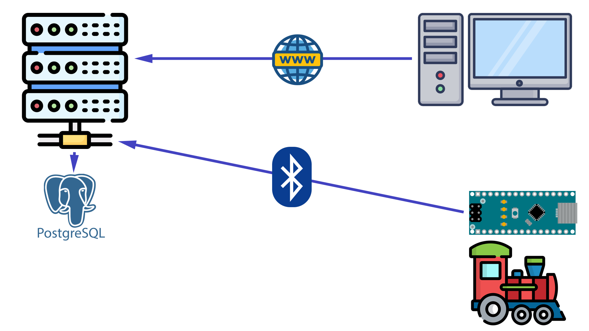
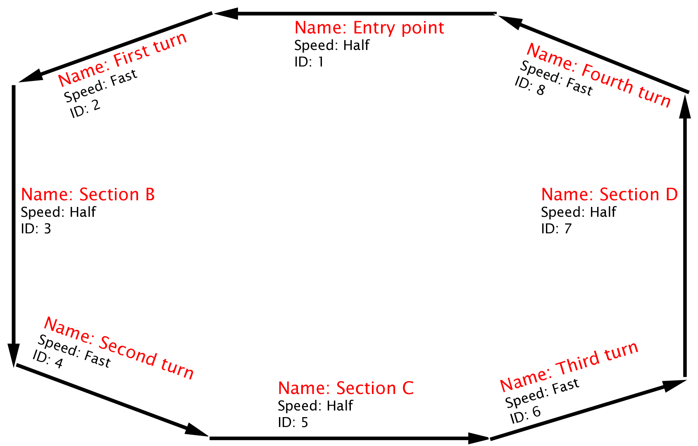
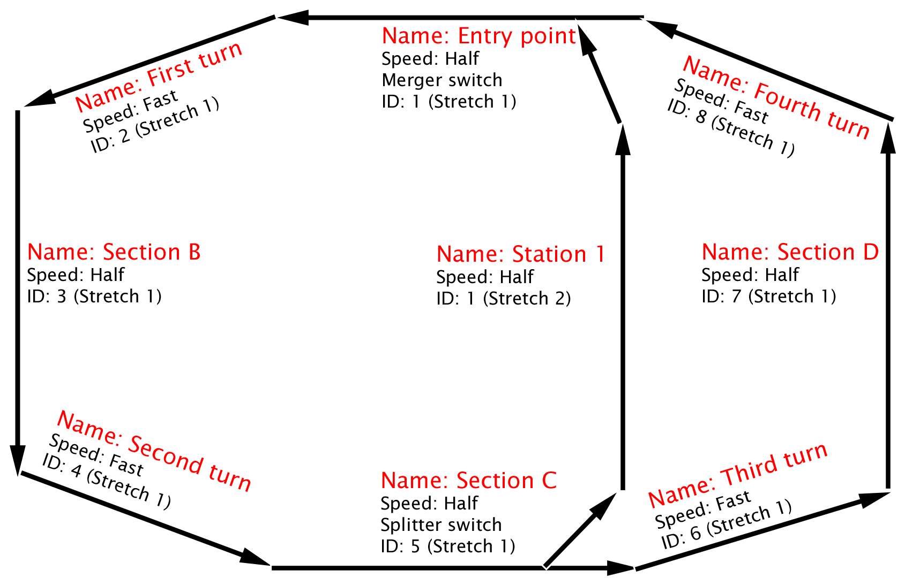
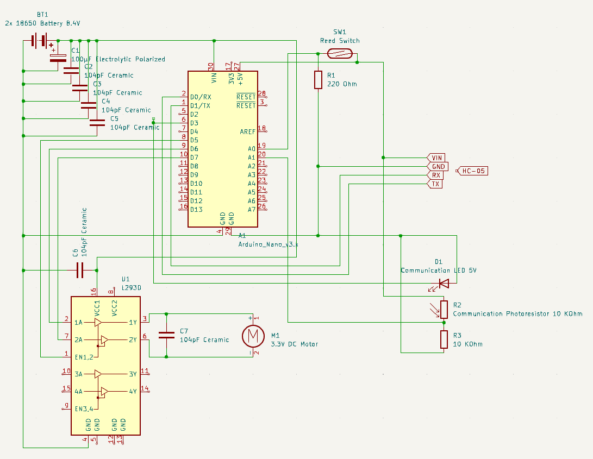
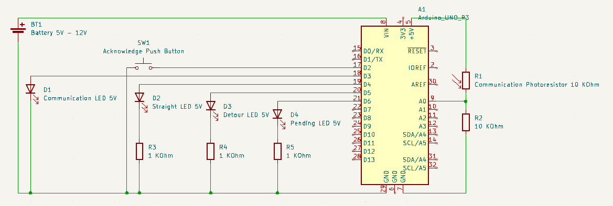

# Arduino Model Train Controller V3

**IMPORTANT: WORK IN PROGRESS**

Arduino Model Train Controller is a program that controls model trains and adds full remote train traffic control: zone blocking, control of the switches, and manual control of the trains. This program focuses on controlling basic model trains modified by adding an Arduino Nano or similar flashed with this software to give the Arduino full control of the model train. This would allow the user to have the full functionality of a remote-controller rail-powered model train in a basic battery-powered model train with no remote control capabilities built-in that has been modified with this software.

The required components to modify the model train are:
- Arduino Nano (or similar)
- HC-05: Bluetooth module that keeps the Arduino in contact with the computer
- L293D chip: to control the built-in motor of the model train
- Reed switch: to detect magnets along the tracks (explained below)
- LED (optional): for train-tracks communication
- Photoresistor (optional): for train-tracks communication

The method to divide the tracks into zones is done by adding small magnets to the tracks (normally by taping them), and attaching a reed switch to the bottom of the model trains. The computer software knows where the trains are because every time they encounter a magnet, they notify the computer and the computer counts the magnets.

## Architecture



This software is divided in three parts: the server, the web application, and the Arduino sketch.

The server is made with GoLang, and it does all the heavy thinking to control the traffic of the trains. It receives connections from the web application and from the model trains. This server requires to have PostgreSQL installed to work.

The web application is made with react, it connects to the server through WebSocket and allows the end user to dispatch trains and control traffic, among other things.

The Arduino sketch is made to be run in an Arduino Nano or similar, and expects a specific pinout and connections. This is described in the "Modifying the toy train" section below. This software must be flashed to the microcontroller using the Arduino IDE.

## Software installation

### Installing PostgreSQL

Download and install PostgreSQL in your system, create a new database and create a user with access to the database.

### Installing the server

Browse to the server's root folder and run the following command:

```bash
go build -o main.exe | .\main.exe
```

### Installing the web application

Browse to the web application's root folder and run the following command:

```bash
npm run-script build
```

And copy the contents of the "build" folder into a web server's root folder.

### Setting up the trains, zones and signals

#### Set up the trains

Go into the web application into the Trains tab. Use the add button to add as much trains are you are going to use. The three speeds are between 1 and 255, and have to follow this rule: 1 <= slow < half < fast <= 255. In this speeds, 1 means the slowest speed that the train can go (set by the *MOTOR_MIN_POWER* constant explained below) and 255 means the fastest speed that the train can go (set by the *MOTOR_MAX_POWER* constant explained below).

#### Set up the stretches

Stretches are separate zones of tracks, normally independent areas interconnected by switches. Stretches can be set up from the Stretches tab in the web application, added using the add button.



For example, in the model above there is only one stretch.



For example, in the model above there are two stretches, separated by switches.

#### Set up the signals

Signals are like semaphores, they are used to keep the trains from entering zones occupied by other trains.
When a train put in the model, the user has to manually input the zone that the train is left at, and then the software will keep tracks of where the train is by counting the times that the train reports magnets in the tracks. Every time a train detects a magnet, it passes a signal (or semaphore), therefore there have to be registered as many signals in the program as magnets there are in the tracks.

The way that the software will use this is that only one train at a time will be allowed in the zone between two magnets. If a train steps on a magnet, and the next zone is occupied, the software tells the train to stop and when the zone is freed, it automatically tells the stopped train to start again.

Also different zones can have different speed limits, set by the user, that will automatically be sent from the software to the trains.

The distance between the magnets can never be lower than the maximum length that is expected from a train, as the software considers that, when the train enters a new zone, it has therefore completely exited the zone where it was before and is available to be occupied by another train.

Additionally, some of the zones can be set up as switches, which can be splitters or mergers. In the case of setting the zone as a splitter, the stretch and signal id required will be the signal to which the train will be sent to in case that the switch is flipped to the detour position. In case that it's set as a merger (not splitter), the stretch and signal id required will be the signal from which it will merge from in case that the switch is flipped to the detour position.

In case that your circuit is a loop, you can set a signal to loop back to another signal by entering the required stretch and signal id.

## Hardware

### Modifying the toy train



Schematics are provided in the docs folder of the circuit that the included sketch expects.

In this schematic, the power supply are two 18650 rechargeable lithium-ion batteries (recommended) (BT1), that provide a voltage of 8.4V when fully charged. This is fed directly to the VIN and GND pins of the Arduino (A1), and to the VCC1 and GND pins of the L293D (U1, motor controller chip).

Pinout for the L293D chip:

| L293D pin | Connection            |
|-----------|-----------------------|
| PIN#1     | Arduino PIN D5        |
| PIN#2     | Arduino PIN D6        |
| PIN#3     | Toy train motor +     |
| PIN#4     | Battery ground        |
| PIN#6     | Toy train motor -     |
| PIN#7     | Arduino PIN D7        |
| PIN#8     | 8.4V from the battery |

The capacitors are optional, but the ceramic ones are recommended in order to reduce the noise generated by the motor. The values might be others as long as they are reasonable.

The reed switch (SW1) must be placed (for example, taped) to the bottom of the train, in order for it to detect the magnets the are along the tracks. One side of the reed switch has to be connected to 5V (or the logic level of the microcontroller used), and the other side has to be connected to the analog pin #0 of the microcontroller and tied to ground though a resistor (R1) (anything between 100 to 1.000 Ohm should work).

The HC-05 Bluetooth module has to be connected to 5V (or the logic level of the microcontroller used) and ground (shared with the microcontroller's ground). Then, the microcontroller's serial TX pin has to be connected to the HC-05's RX, and vice versa. The HC-05 Bluetooth module has to be set to a UART baud rate of 57.600 beforehand. If you don't know how to do this or don't want to do it, you can also set the constant *SERIAL_BAUD_RATE* to 9.600 (default for the HC-05) in the sketch.

Optionally, the train has the ability to use LED blinks to communicate with other microcontrollers in the tracks that controls the switches, as it's described in the "Making the switch controllers" section below. The negative side of the LED (D1) has to be connected to ground (shared with the microcontroller's ground), and the positive side of the LED has to be connected to the microcontroller's D3 pin. The LED shouldn't need a resistor, because it's only going to be used momentarily, and also because we want it as bright as possible to communicate with the other microcontroller. Then, one side of the photoresistor (R2) has to be connected to 5V (or the logic level of the microcontroller used), and the other side has to be connected to the analog pin #1 of the microcontroller and tied to ground though a 10 KOhmn resistor (R3).

#### Adjusting the constants

- ACCESS_KEY: Key given by the web application when a train is registered.
- MOTOR_MAX_POWER: Number between 0 and 255. You can get it by using the following formula:
```
(Battery voltage / 255) * MOTOR_MAX_POWER = Motor voltage
```
For example, to run a 3V (2xAA battery) train with 2x 18650 batteries, MOTOR_MAX_POWER should be set to 91.
- MOTOR_MIN_POWER: Number between 0 and 255. Should always be lower than *MOTOR_MAX_POWER*. This is the lowest voltage at which the train will run for its lowest speed.
- THRESHOLD_UPPER: Used to detect the LED blinks with the photoresistor. The value reported by the ADC must be above this level to detect a HIGH level in the LED. The default value (800) is selected with a 10-bit ADC in mind.
- THRESHOLD_LOWER: Used to detect the LED blinks with the photoresistor. The value reported by the ADC must be below this level to detect a LOW level in the LED. The default value (400) is selected with a 10-bit ADC in mind.

### Making the switch splitteer controllers

Switch controllers are devices that be placed along the switches in the tracks and control the direction of a switch. They receive commands and communicate with the train using LEDs and photoresistors. In order to flip a switch, the software in the computer has to order the train to flip the switch, then the train will send the command to flip (either to the straight or detour position) to the switch controller via an LED aboard the train, and the blinks of the LED will be picked up by the photoresistor of the switch controller. Once the operation is completed, or if it fails, the switch controller will report it back to the train using the controller's LED and the train's photoresistor, so that the train can report that status back to the software in the computer.

These switch controllers have to be placed in front of where the LED and photoresistor are going to be with the train stopped at the magnet just before the switch, so the LEDs from one and the photoresistors of the other are face to face.

#### Communication protocol

All the messages sent through the LEDs follow a pattern of: ON, OFF, ON, OFF, and the time that the LED has spent ON the first time, then the time that it has spent OFF, and finally the time that is has spent ON the second time, will tell what message has been transmitted.

Messages that the train can transmit:

| Message            | Time ON μs | Time OFF μs | Time ON μs |
|--------------------|------------|-------------|------------|
| Switch to straight | 500.000    | 500.000     | 500.000    |
| Switch to detour   | 1.500.000  | 1.500.00    | 1.500.000  |

Messages that the switch can transmit:

| Message              | Time ON μs | Time OFF μs | Time ON μs |
|----------------------|------------|-------------|------------|
| Switching successful | 500.000    | 1.500.000   | 500.000    |
| Switching failed     | 1.500.000  | 500.00      | 1.500.000  |

It is recommended that a margin of error is applied, detecting everything between 300.000μs to 700.000μs as 500.000μs, and everything from 1.300.000μs to 1.700.000μs as 1.500.000μs. Also a 5s timeout during the message reception is recommended.

#### Manual controllers

Manual switch controllers are a type of switch controllers that can't physically flip the switch in the tracks, so they just take the order and turn on an LED to tell the user that the switch is to be flipped, and then the user has to manually actuate the switch and press a push button so the manual switch controller can send the successful command back to the train.

Required hardware:
- 1x Photoresistor
- 4x LED
- 1x Button
- 1x 10KOhm resistor
- 3x 220Ohm resistor



Schematics are provided in the docs folder of the circuit that the included sketch expects.

The power supply may be everything that can power up your microcontroller, although because it has to be made easy to be portable in order to be placed and removed from the tracks easily, a 9V battery or a case with AA batteries might be a good power supply.

The negative side of the LED (D1) has to be connected to ground (shared with the microcontroller's ground), and the positive side of the LED has to be connected to the microcontroller's D3 pin. The LED shouldn't need a resistor, because it's only going to be used momentarily, and also because we want it as bright as possible to communicate with the other microcontroller. Then, one side of the photoresistor (R1) has to be connected to 5V (or the logic level of the microcontroller used), and the other side has to be connected to the analog pin #0 of the microcontroller and tied to ground though a 10 KOhmn resistor (R2).

A push button has to be connected from the microcontroller's D2 pin to ground. This will be the acknowledge button, that the user will have to press once the user has manually actuated the switch.

The pins D4, D5 and D6 will be connected to the positive sides of three LEDs that will be connected to ground through 3 220 Ohm resistors (although anything between 100 to 1.000 Ohm should work fine).

The LED connected to D4 will be the "straight" LED, and will tell the user that the switch is in the "straight position", and the one on D5 will be the "detour" LED to tell the user that this is the position that the switch is in. The LED connected to D6 will be the "needs to be switched" or "pending" LED. If the "pending" LED is on, then the position shown by the first two LEDs is the position that the switch **wants to be**, for example, if both the D4 ad D6 are lit, that means that the user has to move the switch to the straight position and press the acknowledge button.

#### Servomotor controllers

**WORK IN PROGRESS**

#### Stepper motor controllers

**WORK IN PROGRESS**

#### Solenoid motor controllers

**WORK IN PROGRESS**

### Making the switch merger controllers

#### Manual controllers

**WORK IN PROGRESS**

#### Servomotor controllers

**WORK IN PROGRESS**

#### Stepper motor controllers

**WORK IN PROGRESS**

#### Solenoid motor controllers

**WORK IN PROGRESS**

## Contributing

Pull requests are welcome. For major changes, please open an issue first
to discuss what you would like to change.

Please make sure to update tests as appropriate.

## Attribution

Some images and icons are from FlatIcon at [flaticon.com](flaticon.com).

## License

This code is distributed under the [AGPL](https://spdx.org/licenses/AGPL-3.0-only.html) license (AGPL-3.0-only).

You can find the full text of this license in the `COPYING` file.

